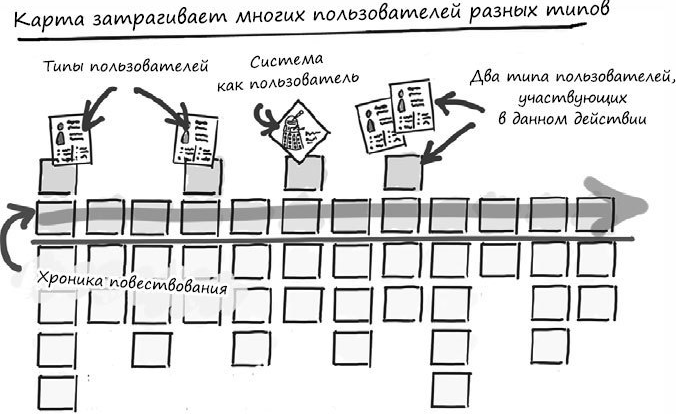
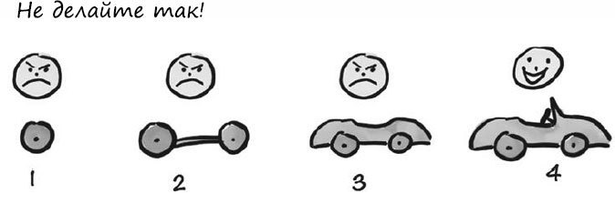
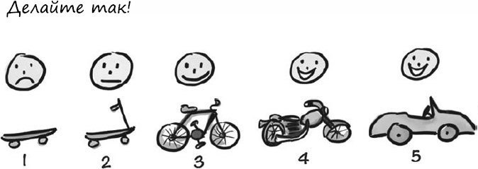

#

## Составление карт историй

Обычно в центре внимания находится карта – последовательное, слева направо, изложение шагов, с помощью которых можно рассказать историю. Детали шагов располагаются сверху вниз. Но самое важное, что формирует продукт и дает больше всего контекста, обычно находится вне карты – это цели продукта,информация о заказчиках и пользователях.

> У вас никогда не будет достаточно людей,времени или денег,чтобы разработать все,что нужно. Никогда.

Когда вы читаете каркас слева направо,он рассказывает историю обо всех людях,которые используют систему и производят какие-то действия

Карты историй позволяют выявить белые пятна в проекте

> Фокусируйтесь на результате – что пользователи увидят и будут способны сделать, когда система выйдет в свет, –
и запланируйте выпуск только того, что обеспечит этот результат

> MVP = Минимально жизнеспособное решение(продукт) – это самое простое решение, при воплощении которого в жизнь успешно достигаются желаемые результаты

## Релизная стратегия

Цикл разработки (эмпирического обучения):
  Создаем MVP с целью определить какую-то идею
  Получаем обратную связь от пользователей и заказчиков
  Извлекаем из этих данных опыт
  Генерируем идеи на улучшение
  Возвращаемся к п.1 и заходим в цикл

По моим предположениям, возможно одна итерация это как раз один спринт
